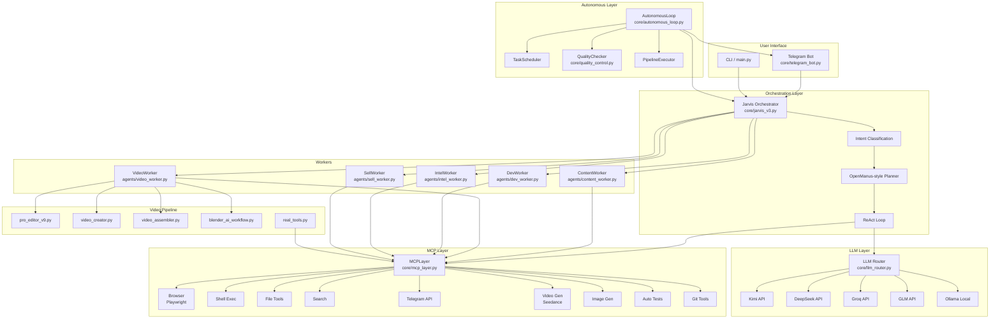
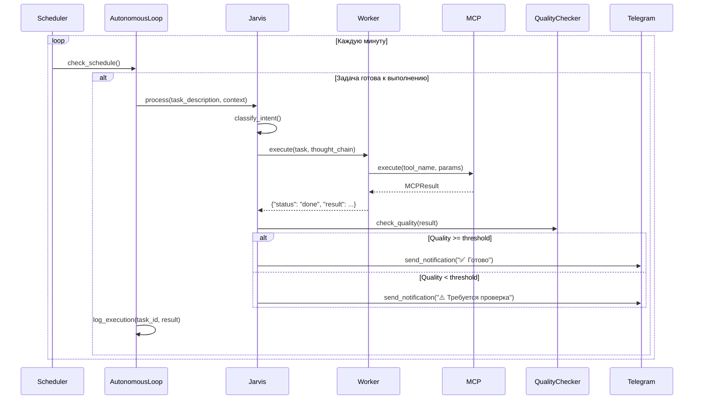
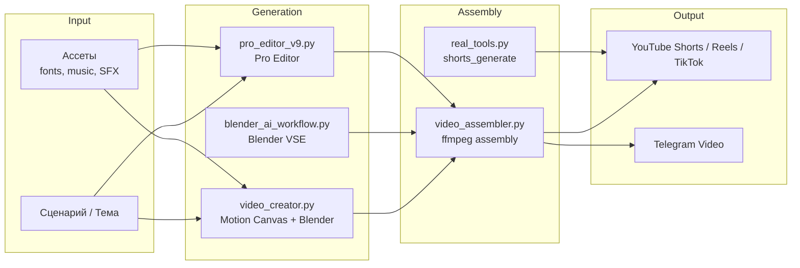

# ARCHITECTURE.md — Digital Clone v3

> Архитектурная документация системы. Описывает компоненты, потоки данных и интерфейсы.

---

## 1. Диаграмма компонентов



---

## 2. Поток данных (Request Flow)

```
┌─────────┐    ┌──────────────┐    ┌─────────────────┐    ┌────────────┐
│  User   │───▶│   Telegram   │───▶│ JarvisOrchestrator│───▶│  Intent    │
│ Request │    │    Bot       │    │                 │    │Classifier  │
└─────────┘    └──────────────┘    └─────────────────┘    └─────┬──────┘
                                                                 │
                    ┌────────────────────────────────────────────┘
                    ▼
┌─────────────┐    ┌──────────────┐    ┌─────────────┐    ┌─────────────┐
│   Response  │◀───│   Format     │◀───│  Validate   │◀───│  Execute    │
│   to User   │    │   & Send     │    │   Result    │    │   Plan      │
└─────────────┘    └──────────────┘    └─────────────┘    └──────┬──────┘
                                                                  │
                    ┌─────────────────────────────────────────────┘
                    ▼
┌─────────────┐    ┌──────────────┐    ┌─────────────┐
│   Worker    │◀───│  LLM Router  │◀───│   Plan      │
│  (Action)   │    │  (Reasoning) │    │  (Thoughts) │
└──────┬──────┘    └──────────────┘    └─────────────┘
       │
       ▼
┌─────────────┐
│  MCP Layer  │
│  (Tools)    │
└─────────────┘
```

### Этапы:

1. **Request** — пользователь отправляет сообщение (текст или голос) в Telegram.
2. **Intent Classification** — Jarvis определяет `IntentType` (content, video, code, intel, sell, system).
3. **Planning** — OpenManus-style planner декомпозирует задачу на sub-tasks с thought chain.
4. **Execution** — каждый sub-task роутится на соответствующего worker'а.
5. **Tool Invocation** — worker вызывает MCP-инструменты (search, browser, file, etc.).
6. **Validation** — результат проверяется на качество (`quality_control.py`).
7. **Response** — итоговый ответ форматируется и отправляется пользователю.

---

## 3. Описание core-модулей

### 3.1 `core/jarvis_v3.py` — JarvisOrchestrator

**Ответственность**: Единая точка входа для всех запросов.

**Ключевые классы**:
- `IntentType(Enum)` — 8 типов намерений: CHAT, CONTENT, VIDEO, CODE, INTEL, SELL, SYSTEM, BUSINESS.
- `TaskStatus(Enum)` — конечный автомат: PENDING → PLANNING → EXECUTING → VALIDATING → DONE/ERROR.
- `AutonomyLevel(Enum)` — 3 уровня: MANUAL(1), ASSISTED(2), AUTONOMOUS(3).
- `JarvisOrchestrator` — главный класс: регистрирует workers, классифицирует intent, оркестрирует execution.

**Интерфейс**:
```python
jarvis = JarvisOrchestrator()
jarvis.register_worker("content", ContentWorker(llm, mcp))
result = await jarvis.process("Создай пост про AI")
# result: {"intent": "content", "status": "done", "result": {...}}
```

### 3.2 `core/llm_router.py` — LLMRouter

**Ответственность**: Маршрутизация между LLM-провайдерами с автоматическим fallback.

**Ключевые классы**:
- `LLMProvider(Enum)` — KIMI, DEEPSEEK, GROQ, OLLAMA, GLM.
- `LLMConfig` — конфигурация одного провайдера (api_key, base_url, model, timeout).
- `LLMRouter` — основной класс: health check, fallback chain, retry logic.

**Fallback Chain**:
```
Kimi (primary) → DeepSeek → Groq → Ollama (local) → GLM (free backup)
```

**Интерфейс**:
```python
llm = LLMRouter()
health = await llm.health_check()
response = await llm.chat(messages=[{"role": "user", "content": "..."}])
```

### 3.3 `core/mcp_layer.py` — MCPLayer

**Ответственность**: Унифицированный доступ к инструментам через MCP-протокол.

**Ключевые классы**:
- `MCPToolType(Enum)` — категории: BROWSER, CODE_EXEC, FILE, SHELL, SEARCH, TELEGRAM, WHISPER, VIDEO_GEN, TEST, GIT, IMAGE_GEN, DATABASE.
- `MCPTool` — dataclass: name, tool_type, description, parameters, handler, requires_approval.
- `MCPResult` — результат выполнения: success, data, error.
- `MCPLayer` — реестр и executor всех инструментов.

**Зарегистрированные инструменты** (15+):

| Категория | Инструменты |
|-----------|------------|
| Browser | browser_navigate, browser_screenshot, browser_click, browser_extract_text |
| Code Exec | exec_python |
| File | file_read, file_write, file_list |
| Shell | shell_exec |
| Search | search_web |
| Telegram | tg_send_message, tg_send_photo |
| Video Gen | video_generate_seedance |
| Image Gen | image_generate |
| Test | test_run, test_syntax_check |
| Git | git_commit, git_status |

**Real Tools** (регистрируются отдельно в `main.py` через `core/real_tools.py`):
- `tg_publish_post` — публикация поста в Telegram
- `shorts_generate` — генерация шортса
- `content_publish_full` — полный pipeline контента
- `video_publish_full` — полный pipeline видео
- `tg_send_video` — отправка видео в Telegram
- `video_create_hybrid` — гибридное создание видео

### 3.4 `core/autonomous_loop.py` — AutonomousLoop

**Ответственность**: Проактивный цикл агента — cron-like задачи без участия пользователя.

**Ключевые классы**:
- `ScheduleType(Enum)` — CRON, INTERVAL, FIXED_TIME.
- `PipelineStage(Enum)` — GENERATE_CONTENT, GENERATE_SCRIPT, GENERATE_VIDEO, QUALITY_CHECK, PUBLISH, PUBLISH_VIDEO, LOG.
- `AutonomousTask` — dataclass: id, name, schedule, pipeline, autonomy_level, enabled, context.
- `AutonomousLoop` — главный event loop: проверяет расписание каждую минуту, выполняет pipeline.

**Pipeline**:
```
generate_content → quality_check → publish → log
generate_script → generate_video → publish_video → log
research_trends → analyze → report → log
```

**Интерфейс**:
```python
loop = AutonomousLoop(jarvis)
await loop.load_schedule("config/autonomous_schedule.json")
await loop.run()  # бесконечный цикл
```

### 3.5 `core/telegram_bot.py` — JarvisTelegramBot

**Ответственность**: Интерфейс пользователя через Telegram.

**Функции**:
- Текстовые сообщения → Jarvis → ответ.
- Голосовые сообщения → Whisper (faster-whisper) → текст → Jarvis.
- Команды: /start, /help, /status, /tasks, /autonomy.
- Уведомления от AutonomousLoop.
- Admin-only команды для управления системой.

### 3.6 `core/quality_control.py` — QualityChecker

**Ответственность**: LLM-based проверка качества контента.

**Проверяет**:
- Длину текста (min/max)
- Наличие hook и CTA
- Количество хэштегов
- Readability score
- Engagement score
- Toxicity
- Spam-паттерны

**Конфигурация**: `config/quality_thresholds.json`

---

## 4. Интерфейсы между слоями

### 4.1 Orchestrator → Workers

```python
# JarvisOrchestrator вызывает:
result = await worker.execute(task, thought_chain)

# Где task — объект с полями:
#   task_id: str
#   description: str
#   intent: IntentType
#   params: Dict[str, Any]
#   autonomy_level: AutonomyLevel

# Где thought_chain — список ThoughtStep:
#   step_id: str
#   reasoning: str
#   action: str
#   observation: str

# Возвращает Dict[str, Any]:
#   status: "done" | "error" | "needs_approval"
#   result: Any
#   metadata: Dict[str, Any]
```

### 4.2 Orchestrator → LLM Router

```python
# JarvisOrchestrator использует:
response = await llm_router.chat(
    messages=[{"role": "system", "content": "..."}, {"role": "user", "content": "..."}],
    model=None,  # auto-select by router
    temperature=0.7,
)
# Возвращает строку ответа или fallback на следующий провайдер.
```

### 4.3 Workers → MCP Layer

```python
# Worker вызывает:
result = await mcp_layer.execute(
    tool_name="browser_navigate",
    params={"url": "https://...", "wait_until": "networkidle"},
)
# Возвращает MCPResult(success=True/False, data=..., error=...)
```

### 4.4 AutonomousLoop → Orchestrator

```python
# AutonomousLoop делегирует выполнение:
result = await jarvis.process(task_description, context=task_context)
# Использует тот же интерфейс, что и пользовательский запрос.
```

### 4.5 AutonomousLoop → TelegramBot

```python
# AutonomousLoop отправляет уведомления:
await bot.send_notification(
    chat_id="@your_channel",
    text="Задача 'Утренний пост' выполнена. Quality: 92/100",
)
```

---

## 5. Data Flow для Autonomous Loop



**Файл конфигурации**: `config/autonomous_schedule.json`

**Текущие задачи**:
- `morning_post` — утренний пост (9:00)
- `evening_post` — вечерний пост (18:00)
- `video_shorts` — шортсы (12:00, каждые 2 дня)
- `trend_check` — проверка трендов (каждые 4 часа)
- `daily_report` — ежедневный отчёт (21:00)
- `learning_loop` — анализ метрик (23:00, воскресенье)
- `afternoon_tip` — дневной лайфхак (14:00, disabled)

---

## 6. Video Pipeline

### 6.1 Архитектура Video Pipeline



### 6.2 Компоненты Video Pipeline

#### `pro_editor_v9.py`
- Последняя stable-версия pro video editor.
- Создаёт шортсы с motion graphics, transitions, kinetic text.
- Использует ffmpeg + Pillow для композитинга.
- Поддерживает phone mockups, scanlines, grain overlays.

#### `core/video_creator.py` — VideoCreator
- Гибридный генератор: Motion Canvas + Blender + ffmpeg.
- Агент описывает ролик → получает готовый MP4.
- `SceneSegment` — один сегмент ролика (type, duration, description, script_code, rendered_path).
- `VideoProject` — полный проект ролика.

#### `core/video_assembler.py`
- Сборка финального видео из сегментов.
- Синхронизация с аудио (TTS через gTTS или faster-whisper).
- Экспорт в разные форматы (MP4 для Shorts, Reels, TikTok).

#### `core/blender_ai_workflow.py`
- Интеграция с Blender для 3D-сцен и motion graphics.
- Генерация Blender-скриптов через LLM.
- Рендеринг через `subprocess` вызов Blender в headless-режиме.

#### `tools/shorts_pipeline.py`
- Полный pipeline: сценарий → генерация видео → озвучка → assembly → публикация.
- Интегрируется с MCP Layer как real tool `shorts_generate`.

#### `tools/tg_publish.py`
- Публикация контента и видео в Telegram.
- Интегрируется с MCP Layer как real tool `tg_publish_post`.

### 6.3 Поток данных Video Pipeline

```
1. VideoWorker получает задачу: "Сделай шортс про MCP протокол"
2. VideoWorker вызывает LLM для генерации сценария
3. VideoWorker выбирает pipeline:
   a. Seedance 2.0 (бесплатно) — для AI-видео
   b. Web-to-Video — HTML → Playwright → ffmpeg
   c. Pro Editor v9 — motion graphics + kinetic text
   d. Blender — 3D-сцены
4. Генерация ассетов (изображения, TTS-аудио)
5. Assembly через video_assembler.py
6. Quality check (длительность, разрешение, аудио)
7. Сохранение в output/ или публикация через tg_publish.py
```

---

## 7. Конфигурация системы

### 7.1 Файлы конфигурации

| Файл | Назначение |
|------|-----------|
| `.env` | API-ключи, токены, секреты. **Не коммитить.** |
| `.env.example` | Шаблон `.env` с пустыми значениями. |
| `config/autonomous_schedule.json` | Cron-задачи для AutonomousLoop. |
| `config/quality_thresholds.json` | Пороги качества для разных типов контента. |
| `requirements.txt` | Python-зависимости. |
| `docker-compose.yml` | Docker-оркестрация (digital-clone + ollama). |
| `Dockerfile` | Образ проекта (python:3.11-slim). |
| `Makefile` | Команды: install, run, test, clean, docker. |

### 7.2 Переменные окружения

```bash
KIMI_API_KEY=sk-...          # Primary LLM
DEEPSEEK_API_KEY=sk-...      # Fallback
GROQ_API_KEY=gsk-...         # Fast fallback
GLM_API_KEY=...              # Free backup
OLLAMA_BASE_URL=http://...   # Local LLM
TELEGRAM_BOT_TOKEN=...       # Telegram Bot
```
